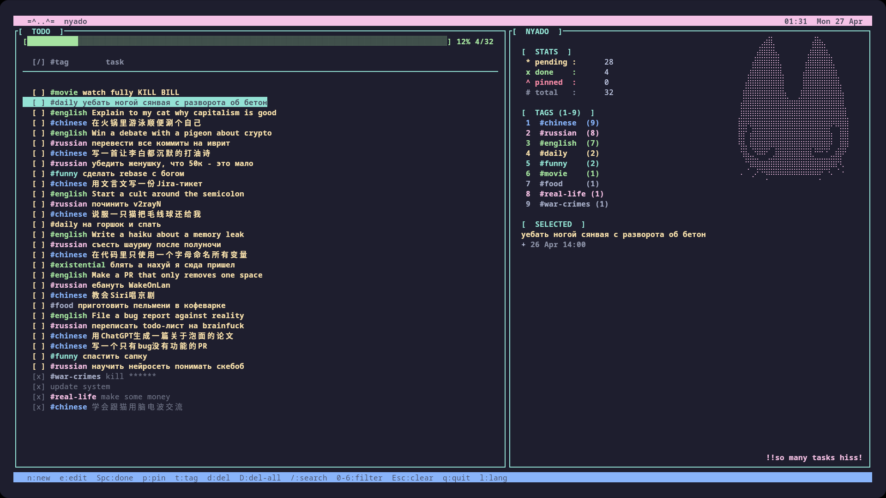

# nyado – a Rust todo‑list with TUI


~~~
nyado is a terminal‑based task manager inspired by meowdo.  
it supports multiple languages, tags, search, pinning, due dates, project folders, etc.
~~~



## Installation

Choose one of the following methods:

### 1. From crates.io (requires Rust)

```
cargo install nyado
```

This will download and compile the latest version. Language files are built into the binary, but you can override them by placing your own `lang_*.toml` files in `~/.config/nyado/` (Linux) or `%APPDATA%\nyado` (Windows).

### 2. Arch Linux (AUR)

If you are on Arch Linux (or an Arch‑based distribution), install one of the AUR packages using your favourite helper (`paru`, `yay`, `pamac`, etc.):

- **Pre‑compiled binary** (fast, no compilation):  
  ```
  paru -S nyado-bin
  ```  
  *Maintainer:* [InTeaReable](https://aur.archlinux.org/account/InTeaReable/) (LeynTheCat on GitHub)

- **Source – release tarball** (compiled from the latest release):  
  ```
  paru -S nyado
  ```  
  *Co-maintainers:* [lmartinez-mirror](https://aur.archlinux.org/account/lmartinez-mirror/) (Luis Martinez, original package author) and [InTeaReable](https://aur.archlinux.org/account/InTeaReable/)

- **Source – latest git commit** (bleeding edge):  
  ```
  paru -S nyado-git
  ```  
  *Maintainer:* [InTeaReable](https://aur.archlinux.org/account/InTeaReable/) (LeynTheCat on GitHub)

All three packages provide the `nyado` command and automatically install the required language files.

### 3. Quick install (binary, no compilation) – Linux only

```curl -sSL https://raw.githubusercontent.com/LeynTheCat/nyado/main/install_bin.sh | bash```

This script:
- Detects your CPU architecture (x86_64 or aarch64)
- Downloads the latest pre‑built static binary from GitHub Releases
- Installs it to `~/.local/bin/`
- Fetches and installs language files to `~/.config/nyado/` (replaces old configs)

### 4. Build from source (via install script) – Linux only

```curl -sSL https://raw.githubusercontent.com/LeynTheCat/nyado/main/install.sh | bash```

The script will:
- Download the latest source code from GitHub
- Install Rust/Cargo automatically (Arch, Debian/Ubuntu, Fedora, openSUSE, or rustup)
- Build nyado in release mode
- Install binary and config files

### 5. Manual installation (git clone)
```
git clone https://github.com/LeynTheCat/nyado.git
cd nyado
./install.sh
```
or without cloning:
```
cargo install --git https://github.com/LeynTheCat/nyado.git
mkdir -p ~/.config/nyado
cp config/*.toml ~/.config/nyado/
```
### 6. Windows

Compiling for Windows is possible – just run `cargo build --release` on a Windows machine with Rust installed.  
**However, I do not provide official support for Windows.**  

To make installation easier, two batch scripts are provided in the repository:

- `nyado_install.bat`   – downloads the latest release from GitHub, installs `nyado.exe` into `%LOCALAPPDATA%\nyado\bin`, and adds it to your user `PATH`.
- `nyado_uninstall.bat` – removes the binary directory and cleans the `PATH` entry.

**Quick setup (recommended):**

1. Download `nyado_install.bat` and run it as a normal user (no admin rights needed).
2. Open a **new** Command Prompt or PowerShell window.
3. Type `nyado` – the TUI should start.

**Manual setup (if you prefer):**

- Place `nyado.exe` in any folder (e.g., `C:\nyado\` or `C:\Program Files\nyado\`).
- Add that folder to your `PATH` environment variable.

**Important notes for all Windows users:**

- Your terminal must support UTF‑8 and CJK characters.
  - Use either standard `cmd.exe` with a TrueType font that supports CJK (e.g., `Consolas`, `Cascadia Code`, `Microsoft YaHei`).
  - Run `chcp 65001` before starting nyado to switch to the UTF‑8 code page.
- **ConEmu is known to have rendering issues** with nyado’s TUI; it may display garbage or crash.
- For the best experience, use **Windows Terminal** or the default console with the above settings.

No official support is provided – but the batch scripts make installation trivial.

## Update

- **Binary installation**: simply run the same quick install command again – it will download the latest binary and update config files.
- **Source installation (from git)**: cd into the cloned directory and run `./install.sh update`.
- **If you used the one‑line curl installer**: just run the same command again – it will overwrite the binary and configs.
- **crates.io version**: run `cargo install nyado --force` to upgrade.
- **AUR packages**: update with your AUR helper, e.g., `paru -Syu nyado-bin`.

## Uninstall

To completely remove nyado (Linux):
```
./install.sh uninstall
```
This deletes the binary from `~/.local/bin/` and the config directory `~/.config/nyado/`.
Your tasks data is stored separately in `~/.local/share/nyado/` – if you want to remove that too, delete it manually:
```
rm -rf ~/.local/share/nyado
```
**Windows**:  
- If installed via `nyado_install.bat`, run `nyado_uninstall.bat`.  
- Otherwise, delete the `nyado.exe` file and remove the folders `%LOCALAPPDATA%\nyado` (data) and `%APPDATA%\nyado` (config) manually.

## Usage

Just run `nyado` from your terminal.

### Key bindings

| Action                   | Keys (English / Russian)                               |
|--------------------------|--------------------------------------------------------|
| Quit                     | q / й                                                  |
| Language switch          | l / L / д / Д                                          |
| Navigate down            | j / о , ↓                                              |
| Navigate up              | k / л , ↑                                              |
| Top / Bottom             | g / п , G / П (or Home / End)                          |
| Page down / up           | PageDown / PageUp                                      |
| New task                 | n / т                                                  |
| **New subtask**          | **Shift+n / Shift+т**                                  |
| Edit task                | e / у                                                  |
| Toggle done              | Space                                                  |
| Pin / unpin              | p / з                                                  |
| Set tag                  | t / е                                                  |
| Delete task              | d / в                                                  |
| Delete all tasks         | D / В (Shift + letter)                                 |
| Search                   | / / .                                                  |
| Filter by tag (1‑9)      | 1…9 (only for existing tags)                           |
| Clear filters            | Esc                                                    |
| Set due date/time        | M / m / ь / Ь                                          |
| **Expand/collapse subtask** | **Enter**                                           |
| Show help                | h / р , ?                                              |
| Project actions          | f / а                                                  |
| Previous project         | [ / х                                                  |
| Next project             | ] / ъ                                                  |

Note: Filtering works for the first nine most‑used tags displayed in the right panel.
Press 1‑9 to filter by that tag, press Esc to clear the filter and the search query.

## CLI commands

nyado can also be used non‑interactively from the command line:
```
  nyado - a TUI todo-list manager

  USAGE:
      nyado [COMMAND] [OPTIONS]
      nyado                (start TUI)

  COMMANDS (CLI):
      --create-project <name>          Create new project
      --delete-project <name>          Delete project (except default)
      --rename-project <old> <new>     Rename project
      --list-projects                  List all projects
      --project-name <name>            Set current project for subsequent task commands (default: default)
      --create-task <text> [--tag <tag>]  Add a task
      --delete-task <index>            Delete task by number (1-based)
      --toggle-task <index>            Mark task as done/undone
      --pin-task <index>               Pin task
      --unpin-task <index>             Unpin task
      --set-due <index> <YYYY-MM-DD>   Set due date
      --list-tasks                     Show all tasks of current project
          [--done] [--pending] [--pinned] [--tag <tag>]  Filter tasks
      --stats                          Show task statistics (total/done/pending/pinned)
      --done-percents                  Show percentage of completed tasks
      --help, -h                       Show this help
      --version, -V                    Show version

  Examples:
      nyado --create-project work
      nyado --project-name work --create-task "Write report" --tag important
      nyado --list-tasks --done
```
## Localisation

- Language files are stored in `~/.config/nyado/lang_*.toml` (Linux) or `%APPDATA%\nyado\lang_*.toml` (Windows).
- You can add your own language by placing a `lang_xx.toml` file there (just copy an existing one and translate).

## Data storage

All data (projects, backups) is stored in:

- **Linux**: `~/.local/share/nyado/`
- **Windows**: `%LOCALAPPDATA%\nyado\`

Inside this directory:
- `projects/` – YAML files, one per project (e.g., `default.yaml`, `work.yaml`).
- `projects/.backups/<project>/` – rotating backups (`00.bak` … `max_backups`).

Old plain‑text format (.txt) is still read once for migration, but new projects and all updates are written in YAML.

### YAML structure

Each project file contains a list of tasks with the following fields:
```
- id: 1234567890                 # unique ID
  parent_id: null                # if present – this task is a subtask
  depth: 0                       # nesting level (automatically maintained)
  done: false
  pinned: false
  tag: "work"                    # tag name (empty string = no tag)
  text: "Write documentation"
  created_at: 1734567890         # Unix timestamp (seconds)
  done_at: 0                     # 0 if not done
  due_date: 0                    # 0 if no due date
  children: []                   # list of subtasks (same structure)
```
The file is a valid YAML sequence – you can edit it manually, but be careful with indentation.
Field depth is automatically recalculated when loading; you don't have to maintain it by hand.

### Legacy TXT format (deprecated)

Older versions used a pipe‑separated line format. This format is no longer used for saving, but nyado will automatically convert any existing .txt project file to YAML on first run. The original .txt file is renamed to .txt.migrated.
After migration, only the YAML file is used.

Format of the old .txt line:
```
<pin>|<done>|<tag>|<text>|<created_at>|<done_at>|<due_date>
```
You may edit these files manually, but be cautious.

## Requirements

- **Linux** (x86_64 or aarch64) – any distribution with a decent terminal (unicode support).
  - For the binary installer: `curl`.
  - For the source installer: Rust toolchain (installed automatically if missing).

- **Windows**
  - A terminal that supports UTF‑8 and CJK fonts:
    - **Recommended:** Windows Terminal
    - **Alternative:** `cmd.exe` with a TrueType font (e.g., `Cascadia Code`, `Consolas`, `Microsoft YaHei`) and run `chcp 65001` before launching nyado.
  - `curl` is only needed if you download the binary manually; the provided `.bat` script uses PowerShell.

## Contributing

Feel free to open issues or pull requests.
The code is modular (each UI component lives in src/ui/), and the i18n system supports adding new languages easily.